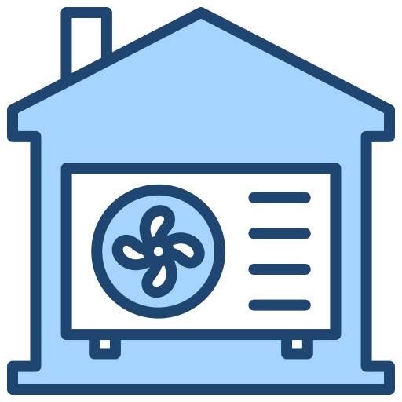
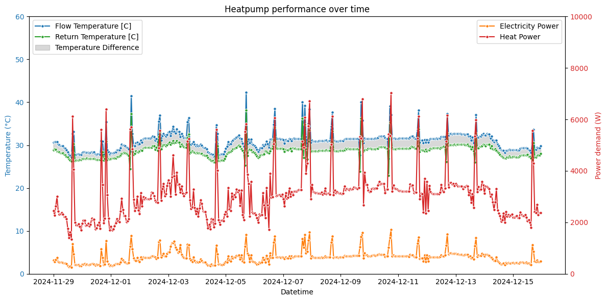
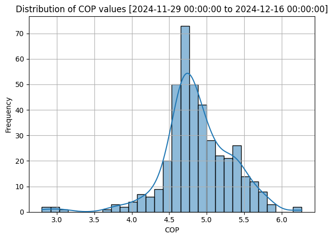
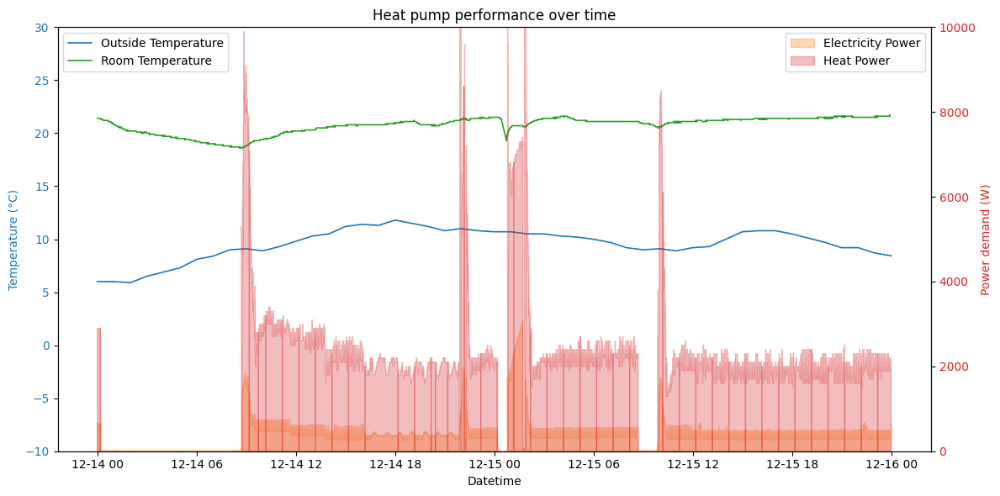

# HeatPumpMonitor `API` client

[](https://www.python.org/downloads/release/python-380/)




This project consumes the [HeatPumpMonitor.org](https://heatpumpmonitor.org) API for the purpose of data analysis and visualization. The API provides real-world heat pump performance data from heat pumps installed in different locations around the UK. The data is collected by volunteers and is made available to the public for research purposes.


## Installation

1. Clone the repository:
    ```sh
    git clone https://github.com/guxsousa/heat-pump-monitor.git
    ```

2. Navigate to the project directory:
    ```sh
    cd heat-pump-monitor
    ```

3. Install Poetry if you haven't already:
    ```sh
    curl -sSL https://install.python-poetry.org | python3 -
    ```

4. Initiate a new Python project:
    ```sh
    poetry init
    ```

4. Install dependencies using Poetry:
    ```sh
    poetry install
    ```

5. Activate the virtual environment:
    ```sh
    poetry shell
    ```


## Installation with Docker

Genrate requirements.txt
```sh
poetry export --without-hashes --format=requirements.txt > requirements.txt
```

Build Dockerfile
```sh
docker build -t hpapi .
```

Find image-id
```sh
docker images 
```

Run iterative session
```sh
docker run --rm -ti -p 8080:8080 <copied-image>
```

Verify active session
```sh
docker ps --all
```


## Usage

Provide examples of how to use the project:
```sh
cd workflows
python tester.py --help
```


## Screenshots




